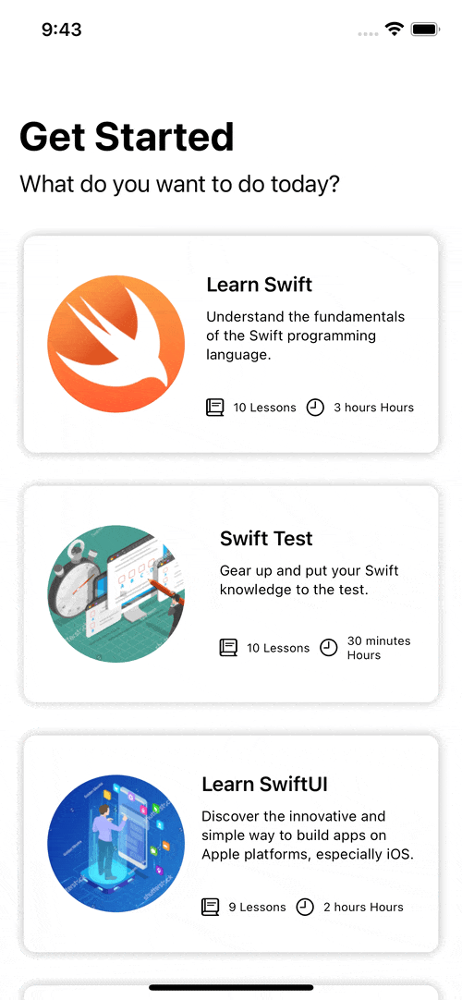

# LearningApp

Swift learning app built using the SwiftUI framework

### Utilizes the following features:
- AVKit Framework
- UIKit Views
- NavigationView/NavigationLink
- ScrollView
- TabBar
- Lazy Stacks
- EnvironmentObject
- State
- TabView
- MVVM
- Local and remote JSON Data
- JSON Decoding
- Do/Catch
- Guard

